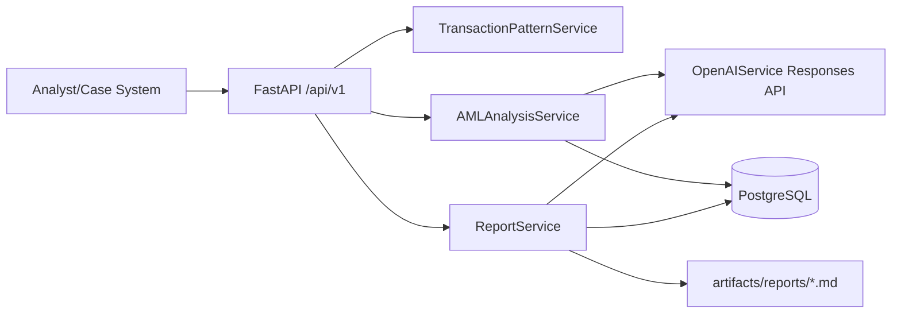

# ai-aml-investigation-assistant

Enterprise-grade AML investigation decision-support backend that combines deterministic transaction heuristics with OpenAI Responses API structured outputs.

## Why this project matters
AML operations teams need consistent, auditable case narratives and risk-oriented recommendations under tight SLAs. This project shows production-minded AI workflow automation for investigation support without replacing human judgment.

## Banking / AML workflow use case
Input: customer profile, alerts, transactions, analyst notes, policy context.
Output: structured analysis JSON + formal memo drafts for analyst review and escalation workflows.

## Architecture overview
- FastAPI versioned REST API
- Deterministic transaction pattern extraction
- OpenAI Responses API integration in isolated service layer
- PostgreSQL persistence with SQLAlchemy + Alembic
- Structured logs and request IDs
- Markdown report artifacts in `artifacts/reports/`



## Repository structure
```text
app/
  api/v1/routes.py
  core/{config.py,logging.py}
  db/session.py
  models/entities.py
  repositories/case_repository.py
  schemas/case.py
  services/{openai_service.py,aml_analysis_service.py,transaction_pattern_service.py,report_service.py}
  prompts/{system.md,analysis.md,report.md}
alembic/
examples/{cases,reports}
artifacts/reports/
tests/{unit,integration}
```

## Prerequisites
- Python 3.12
- Docker + Docker Compose
- OpenAI API key (for non-mocked runtime analysis/report generation)

## Environment variables
| Variable | Description | Default |
|---|---|---|
| `OPENAI_API_KEY` | OpenAI API key | `test-key` |
| `OPENAI_MODEL_ANALYSIS` | Analysis model | `gpt-4.1-mini` |
| `OPENAI_MODEL_REPORTS` | Report model | `gpt-4.1-mini` |
| `OPENAI_REQUEST_TIMEOUT_SECONDS` | SDK timeout | `30` |
| `DATABASE_URL` | SQLAlchemy DB URL | local postgres URL |

## Docker quickstart
```bash
cp .env.example .env
docker compose up --build
```

## Run database migration
```bash
alembic upgrade head
```

## Analyze a case
```bash
curl -X POST http://localhost:8000/api/v1/cases/analyze \
  -H "Content-Type: application/json" \
  -d @examples/cases/case_structuring.json
```

## Draft a report
```bash
curl -X POST http://localhost:8000/api/v1/cases/draft-report \
  -H "Content-Type: application/json" \
  -d '{"case_id":"AML-2026-001","output_type":"analyst_memo"}'
```

## Example analysis JSON response
```json
{
  "request_id": "resp_123",
  "correlation_id": "0f5f...",
  "model": "gpt-4.1-mini",
  "latency_ms": 842,
  "analysis": {
    "case_id": "AML-2026-001",
    "summary": "Clustered cash deposits followed by outbound transfers warrant enhanced review.",
    "observed_patterns": ["potential indicator of structuring"],
    "risk_indicators": [{"indicator": "Sub-threshold deposits", "severity": "high", "rationale": "Repeated near-threshold values"}],
    "assessment": "Activity may be consistent with layering behavior; insufficient information to conclude.",
    "recommended_actions": ["verify source of funds", "obtain beneficiary documentation"],
    "escalation": {"recommended": true, "reason": "multi-signal risk with limited corroborating records"},
    "limitations": ["counterparty KYC unavailable"],
    "confidence": "medium"
  }
}
```

## Example report excerpt
See `examples/reports/example_report_excerpt.md`.

## Example sample case list
- `case_structuring.json`
- `case_cross_border.json`
- `case_dormant_reactivation.json`
- `case_rapid_inout.json`
- `case_high_frequency_small.json`
- `case_profile_mismatch.json`

## Deterministic pattern extraction
Implemented rules include:
- repeated sub-threshold transactions
- rapid movement of funds (inbound/outbound ratio)
- sudden spike in volume
- cross-border corridor spread
- unusual transaction frequency
- profile/behavior mismatch

## OpenAI structured output design
`AMLAnalysisService` sends deterministic signals + case payload and enforces strict JSON schema via Responses API `text.format.type=json_schema`.

## Testing
```bash
pytest
```
Tests mock service behavior for integration routes and do not require real OpenAI credentials in CI.

## Linting
```bash
ruff check app tests
ruff format app tests
```

## Troubleshooting
- `connection refused postgres`: ensure compose stack healthy.
- `OpenAI auth errors`: set `OPENAI_API_KEY`.
- `validation error`: verify case payload fields and enums.

## Design decisions and trade-offs
- Chose deterministic + LLM synthesis for explainability.
- Stored snapshots/results for auditability.
- Avoided heavy agent frameworks to keep code reviewable.

## Limitations
- Demo-level sanitization and storage controls.
- No sanctions/watchlist integration.
- Rule heuristics are intentionally simple.

## Roadmap
- configurable rule thresholds
- optional Redis caching for repeated analysis
- richer token/cost telemetry dashboards

## Security / privacy / compliance disclaimer
This repository is a decision-support demonstration. It does not determine criminal liability, and outputs require trained analyst validation. Do not use with unredacted production PII without organizational controls.

## License
MIT
